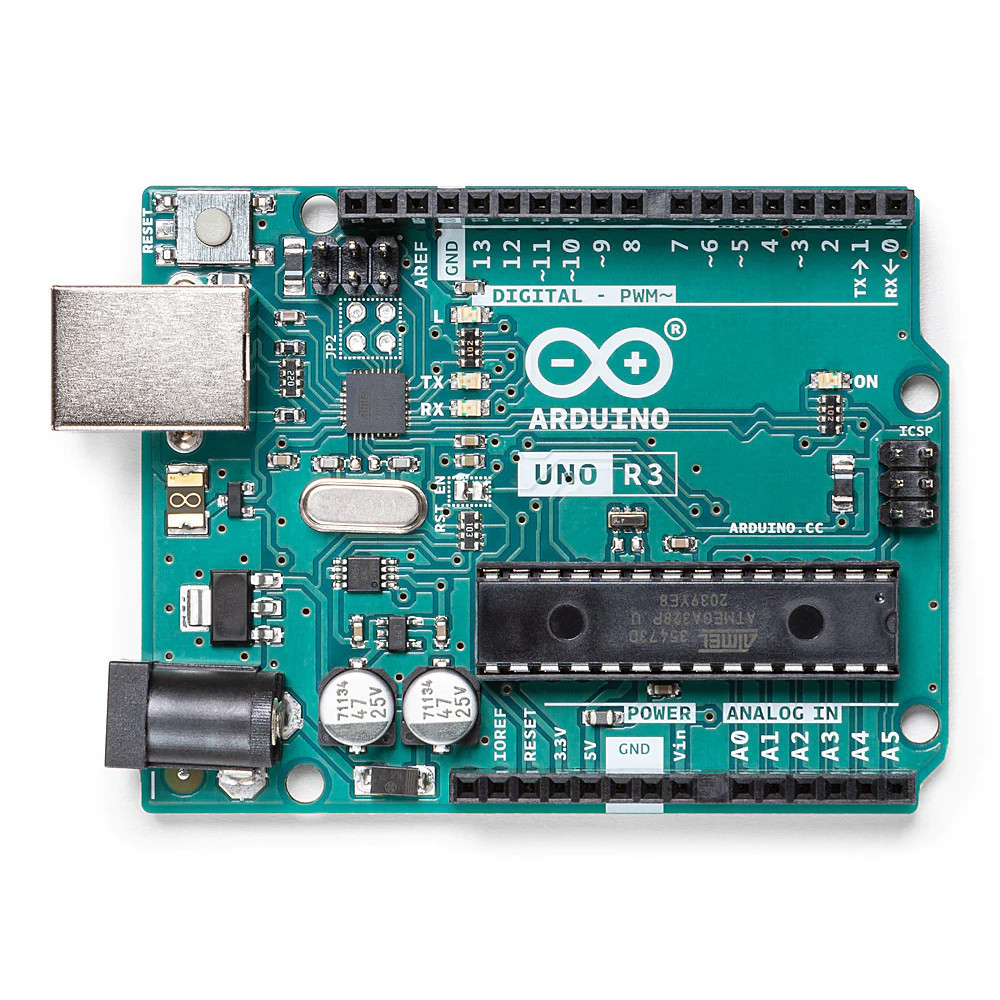

# Bonjour, je vais vous montrer comment obtenir l’IDE Arduino sur un Raspberry Pi 5

## La première méthode est via le site officiel

[Arduino](https://arduino.cc/en/software/)

vous pouvait ajuster les propriétés et executer sous forme de code

## La deuxieme méthode est via le terminal

voici le code a utiliser

sudo apt update && sudo apt install arduino -y

sudo usermod -aG dialout $USER

puis redemarrer votre raspberry pi 5

